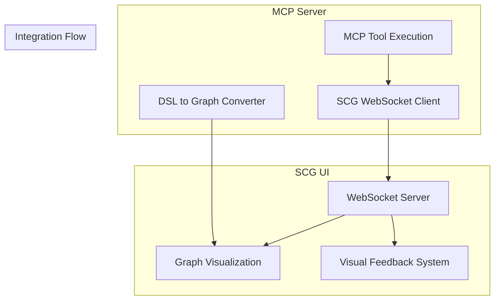

# SCG Integration for Ferrum MCP Tools

This document describes the integration between Ferrum MCP tools and the Semantic Code Graph (SCG) UI, enabling real-time visual feedback and automatic graph updates when tools are executed.

## Overview

The SCG integration provides:

- **Real-time Updates**: Tool execution results automatically appear in SCG UI
- **Visual Feedback**: Progress indicators, success/error messages, and status updates
- **Graph Synchronization**: Automatic conversion of Ferrum DSL to visual graph representation
- **Project Management**: Automatic project subscription and graph updates

## Architecture



## Features

### 1. Real-time Tool Execution Updates

When MCP tools are executed, the SCG UI receives real-time updates:

- **Tool Started**: Shows progress indicator
- **Tool Progress**: Updates with intermediate results
- **Tool Completed**: Shows success message and results
- **Tool Failed**: Shows error message with details

### 2. Visual Feedback System

The integration provides rich visual feedback:

- **Success Messages**: Green notifications for successful operations
- **Error Messages**: Red notifications with error details
- **Warning Messages**: Yellow notifications for warnings
- **Info Messages**: Blue notifications for general information
- **Progress Indicators**: Real-time progress updates

### 3. Automatic Graph Updates

When tools generate or modify Ferrum projects:

- **Project Initialization**: New projects automatically appear in SCG
- **DSL Compilation**: Graph updates reflect compiled changes
- **AI Generation**: AI-generated architectures load in visual editor
- **Real-time Sync**: Changes sync immediately to connected clients

### 4. Project Management

- **Auto-subscription**: Tools automatically subscribe to relevant projects
- **Multi-project Support**: Handle multiple projects simultaneously
- **Session Management**: Track user sessions and project access

## WebSocket Message Types

### Outgoing Messages (MCP → SCG)

#### Tool Execution Updates
```json
{
  "type": "mcp-tool-update",
  "projectId": "my-project",
  "updateType": "tool-execution",
  "data": {
    "tool": "ferrum_init",
    "status": "started|completed|failed",
    "parameters": {...},
    "result": {...}
  },
  "timestamp": "2024-01-10T10:00:00Z",
  "source": "ferrum-mcp"
}
```

#### Visual Feedback
```json
{
  "type": "mcp-tool-update",
  "projectId": "my-project",
  "updateType": "visual-feedback",
  "data": {
    "feedbackType": "success|error|warning|info|progress",
    "message": "Tool completed successfully",
    "tool": "ferrum_compile",
    "details": {...}
  },
  "timestamp": "2024-01-10T10:00:00Z",
  "source": "ferrum-mcp"
}
```

#### Graph Updates
```json
{
  "type": "mcp-tool-update",
  "projectId": "my-project",
  "updateType": "graph-updated",
  "data": {
    "nodeCount": 5,
    "edgeCount": 3,
    "generatedFiles": ["backend/src/main.rs"],
    "graphData": {...}
  },
  "timestamp": "2024-01-10T10:00:00Z",
  "source": "ferrum-mcp"
}
```

#### AI Generation Updates
```json
{
  "type": "mcp-tool-update",
  "projectId": "my-project",
  "updateType": "ai-generation",
  "data": {
    "status": "generating|completed|failed",
    "prompt": "Create a user management system",
    "ai_model": "gpt-4",
    "output_file": "gen/user_system.yaml",
    "graphData": {...}
  },
  "timestamp": "2024-01-10T10:00:00Z",
  "source": "ferrum-mcp"
}
```

#### PermaGraph Sync Updates
```json
{
  "type": "mcp-tool-update",
  "projectId": "my-project",
  "updateType": "permagraph-sync",
  "data": {
    "status": "success|failed|in_progress",
    "syncId": "sync-123",
    "timestamp": "2024-01-10T10:00:00Z"
  },
  "timestamp": "2024-01-10T10:00:00Z",
  "source": "ferrum-mcp"
}
```

### Incoming Messages (SCG → MCP)

#### Project Subscription Confirmation
```json
{
  "type": "subscribed",
  "projectId": "my-project",
  "timestamp": "2024-01-10T10:00:00Z"
}
```

#### Heartbeat Response
```json
{
  "type": "pong",
  "timestamp": "2024-01-10T10:00:00Z"
}
```

## Tool-Specific Integration

### ferrum_init

**SCG Integration Features:**
- Automatic project subscription
- Graph generation from example DSL
- Visual confirmation of project creation
- Next steps guidance

**Visual Feedback:**
- "Creating new Ferrum project..."
- "Project structure generated"
- "Loading architecture in visual editor"

### ferrum_compile

**SCG Integration Features:**
- Real-time compilation progress
- Graph updates with generated code
- Error/warning visualization
- PermaGraph sync status

**Visual Feedback:**
- "Compiling DSL files..."
- "Generated X files successfully"
- "Architecture updated in visual editor"

### ferrum_prompt

**SCG Integration Features:**
- AI generation progress tracking
- Real-time DSL creation updates
- Automatic graph visualization
- Pattern usage feedback

**Visual Feedback:**
- "AI is analyzing your prompt..."
- "Generating architecture..."
- "AI-generated design loaded"

### ferrum_doctor

**SCG Integration Features:**
- Health status visualization
- Dependency check results
- Service availability updates
- Recommendations display

**Visual Feedback:**
- "Checking project health..."
- "All systems healthy ✅"
- "Found X issues that need attention"

### ferrum_dev

**SCG Integration Features:**
- Development server status
- Service URL updates
- Real-time development feedback

**Visual Feedback:**
- "Starting development environment..."
- "Services running at http://localhost:3000"

## API Endpoints

### GET /scg/status
Get current SCG connection status and subscriptions.

**Response:**
```json
{
  "scg_connected": true,
  "scg_url": "ws://localhost:3000",
  "subscriptions": [
    {
      "projectId": "my-project",
      "userId": "mcp-server",
      "subscribedAt": "2024-01-10T10:00:00Z"
    }
  ],
  "timestamp": "2024-01-10T10:00:00Z"
}
```

### POST /scg/subscribe/:projectId
Subscribe to SCG project updates.

**Request Body:**
```json
{
  "userId": "user-123"
}
```

**Response:**
```json
{
  "success": true,
  "projectId": "my-project",
  "message": "Subscribed to SCG project"
}
```

### POST /scg/update/:projectId
Send custom update to SCG.

**Request Body:**
```json
{
  "updateType": "custom-update",
  "data": {
    "message": "Custom update data"
  }
}
```

### POST /scg/feedback/:projectId
Send visual feedback to SCG.

**Request Body:**
```json
{
  "feedbackType": "success",
  "message": "Operation completed successfully",
  "data": {
    "details": "Additional context"
  }
}
```

## Configuration

### Environment Variables

- `SCG_API_URL`: SCG API base URL (default: http://localhost:3000)
- `SCG_WS_URL`: SCG WebSocket URL (default: ws://localhost:3000)
- `MCP_PORT`: MCP server port (default: 8001)

### Docker Compose Integration

The MCP server automatically connects to SCG when both services are running in the same Docker network:

```yaml
services:
  mcp-server:
    environment:
      SCG_API_URL: http://scg-ui:3000
      SCG_WS_URL: ws://scg-ui:3000
    depends_on:
      - scg-ui
    networks:
      - shared_network
```

## Error Handling

### Connection Failures
- Automatic reconnection with exponential backoff
- Graceful degradation when SCG is unavailable
- Logging of connection issues

### Message Failures
- Retry logic for failed message sends
- Error logging with context
- Fallback to local logging when WebSocket fails

### Graph Conversion Failures
- Fallback to basic project information
- Error reporting to SCG
- Continued tool execution despite conversion failures

## Testing

### Unit Tests
```bash
npm run test:scg
```

### Integration Tests
```bash
npm run test:scg-integration
```

### Advanced Tests
```bash
npm run test:scg-integration -- --advanced
```

### Manual Testing

1. **Start Services:**
   ```bash
   docker-compose -f docker-compose.shared.yml up -d
   docker-compose -f docker-compose.ferrum.yml up -d
   ```

2. **Test Tool Execution:**
   ```bash
   curl -X POST http://localhost:8001/execute/ferrum_doctor \
     -H "Content-Type: application/json" \
     -d '{"parameters": {"project_path": "."}}'
   ```

3. **Check SCG UI:**
   - Open http://localhost:3000
   - Look for real-time updates in the UI
   - Check visual feedback notifications

## Troubleshooting

### Common Issues

1. **SCG WebSocket Not Connected**
   - Check if SCG UI is running
   - Verify network connectivity
   - Check firewall settings

2. **Messages Not Appearing in SCG**
   - Verify project subscription
   - Check WebSocket connection status
   - Review server logs

3. **Graph Updates Not Working**
   - Check DSL file format
   - Verify converter functionality
   - Review graph data structure

### Debug Mode

Enable debug logging:
```bash
export LOG_LEVEL=debug
npm start
```

### Health Checks

Check integration health:
```bash
curl http://localhost:8001/scg/status
```

## Performance Considerations

- **Message Batching**: Large updates are batched to prevent flooding
- **Connection Pooling**: Efficient WebSocket connection management
- **Error Recovery**: Fast recovery from connection failures
- **Memory Management**: Proper cleanup of subscriptions and connections

## Security

- **Input Validation**: All messages are validated before sending
- **Rate Limiting**: Protection against message flooding
- **Authentication**: Integration with SCG authentication system
- **Secure WebSockets**: Support for WSS in production

## Future Enhancements

- **Bi-directional Communication**: SCG → MCP tool triggering
- **Advanced Visualizations**: Custom graph layouts for Ferrum
- **Collaboration Features**: Multi-user tool execution
- **Performance Metrics**: Real-time performance monitoring
- **Plugin System**: Extensible integration framework